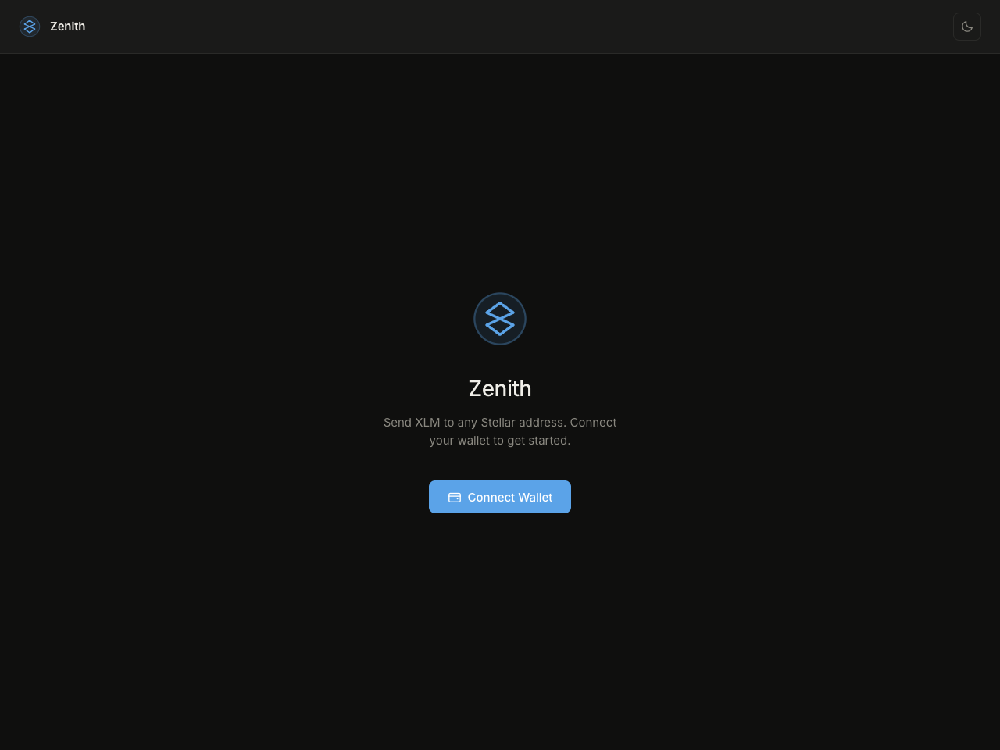
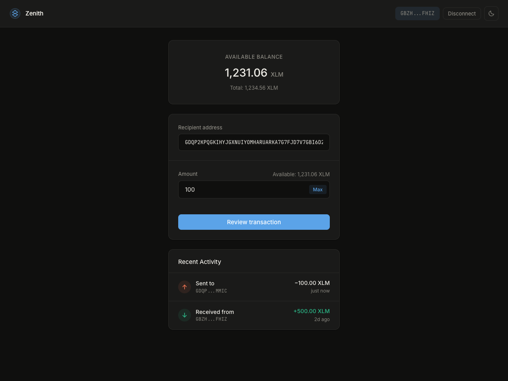
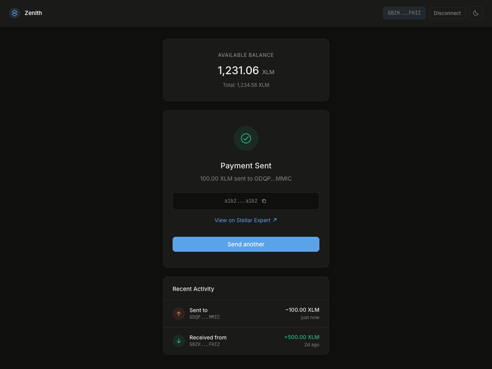
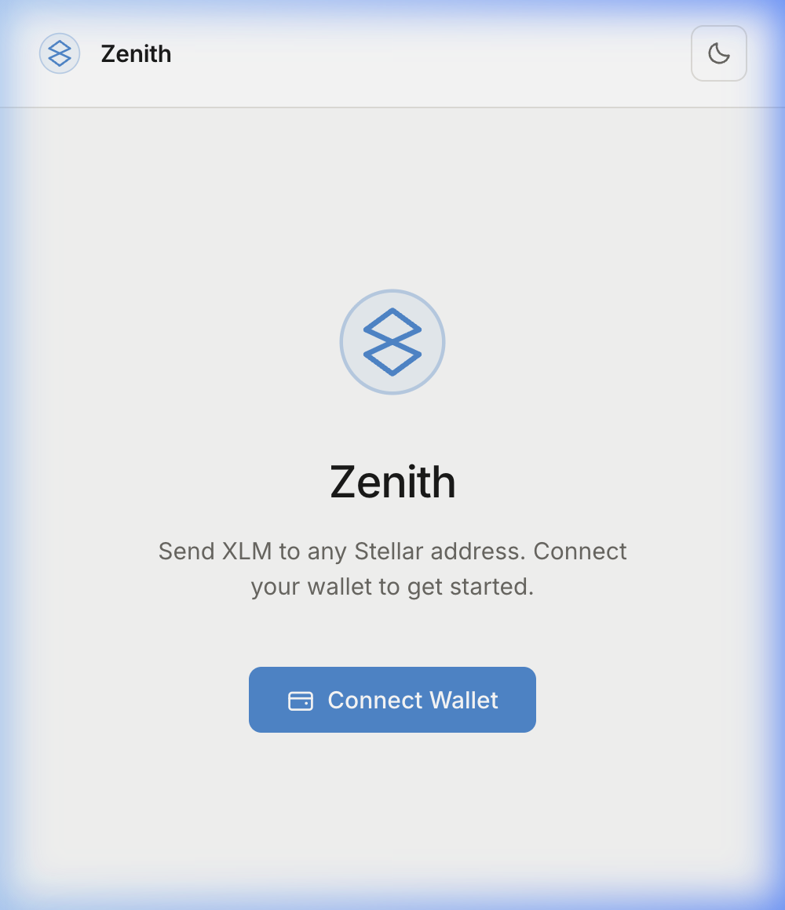

# ⭐ Zenith — XLM Payments

[](https://github.com/MeghiyaT/Zenith/actions/workflows/ci.yml)

**Live Demo:** [https://zenith-woad.vercel.app/](https://zenith-woad.vercel.app/)

Zenith is a focused, high-performance decentralized application (dApp) built for the Stellar network. It provides a clean, zero-noise interface for sending XLM (Stellar Lumens) from any Freighter-connected wallet to any valid Stellar address.

Designed with a strict 8pt grid system, Zenith offers a premium user experience with both light and dark mode support, real-time transaction validation, and a seamless payment history overview.

---

## 📸 Demo & Screenshots

### 🎥 Demo Video
[Watch the 1-minute v1.2 demo on Loom](https://www.loom.com/share/bba83a3f3e89489f8118bd3bd3c3475d)
> *Covers: Wallet connect, 3-step progress pills, SSE tracker status, and passing Vitest suite.*

### 🛠️ Visual Polish
| Landing & Connection | Dashboard & Balance | Success Feedback | Mobile View (Responsive) |
|---|---|---|---|
|  |  |  |  |

---

## 🚀 Key Features

- **Freighter Wallet Integration:** Securely connect and sign transactions using the [Freighter extension](https://www.freighter.app/).
- **Production-Grade Loading:** Shimmering skeleton loaders (1.4s) and unified button spinners for all async states.
- **3-Step Send Flow:** Visual step progress (Contract Recording → Wallet Signing → Network Broadcasting) with pill-shaped indicators.
- **Zenith Vault (v2.0):** Advanced time-locked savings vault featuring **inter-contract calls** to the Stellar Asset Contract (SAC).
- **Mobile First Design:** Fully responsive 8pt grid system optimized for both desktop and mobile devices.
- **CI/CD Pipeline:** Automated GitHub Actions for Rust contract testing and React frontend validation.
- **Real-Time Payment Tracker:** SSE-based status updates for PENDING, CONFIRMED, and FAILED states with a live connectivity indicator.
- **In-Memory Caching:** High-performance caching layer for account balances (15s), address existence (60s), and contract records.

---

## 🛠️ Local Setup

### Prerequisites
- Node.js (v18+)
- Rust (for contract development)
- [Freighter Wallet Extension](https://www.freighter.app/) (configured to Stellar Testnet)

### Installation
1. **Clone & Install:**
   ```bash
   git clone <repository-url>
   cd Zenith
   npm install
   ```
2. **Environment Setup:**
   ```bash
   cp .env.example .env
   # Add your VITE_WALLETCONNECT_PROJECT_ID, VITE_CONTRACT_ID, and VITE_VAULT_CONTRACT_ID
   ```
3. **Run:**
   ```bash
   npm run dev
   ```

---

## 🏗️ Technical Stack

- **Framework:** React 18 + Vite
- **Blockchain SDK:** `@stellar/stellar-sdk` & `@stellar/freighter-api`
- **Smart Contracts:** Soroban (Rust) on Stellar Testnet
- **CI/CD:** GitHub Actions (Contract & Frontend tests)
- **Testing:** Vitest (Frontend) & Cargo Test (Contracts)
- **Styling:** Vanilla CSS (8pt Grid System + Responsive Breakpoints)

---

## 📜 Soroban Contracts

### 1. Payment Record
**Contract ID:** `CBX7NZ2PDC44A2RMMZFVITG4GPUMOLNNGMY76M67XM6JW4TNZ75MGINZ`  
**Deploy TX Hash:** `14e791b96ff9987ed9f1c1a874e8b9444fc70935235858480df3cdd72b80b45d`  
Logs payment metadata for indexing.

### 2. Zenith Vault (New in v2.0)
**Contract ID:** `CANRFTYHEFAZWJ2CKHOBXYZWFUCZCF5SWALAXAODAP4FBDEKME664ZU5`  
**Deploy TX Hash:** `354b7917aaa4aefb463f54733b893cae8678a3c3ecc875a4f057971fec763f82`  
**Token Address:** `CDLZFC3SYJYDZT7K67VZ75HPJVIEUVNIXF47ZG2FB2RMQQVU2HHGCYSC` (Testnet Native XLM SAC)  
Handles time-locked XLM deposits via inter-contract calls to the XLM Stellar Asset Contract (SAC).

### Contract Functions (Vault)
| Function | Parameters | Description |
|---|---|---|
| `deposit` | `user, token_id, amount` | Transfers tokens from user to vault (Inter-contract call) |
| `withdraw` | `user, token_id, amount` | Transfers tokens back to user after 60s lock |
| `get_balance` | `user` | Returns the vault balance for a specific user |

---

## 🧪 Testing & CI/CD

### Automated Pipeline
Zenith uses GitHub Actions (`.github/workflows/ci.yml`) to ensure every push is production-ready.
- **Frontend:** `npm run test` (Vitest)
- **Contracts:** `cargo test` (Soroban SDK testutils)

### Manual Testing
```bash
# Run contract tests
cd contracts/zenith_vault && cargo test

# Run frontend tests
npm test
```

---

## 📜 Milestone History

### v2.0 — Advanced Ecosystem
- **[bed1cff]** `feat: implement Zenith Vault UI and frontend integration`
- **[dc9d9ae]** `style: enhance mobile responsiveness for dashboard and vault`
- **[241ed9b]** `ci: add zenith ci/cd workflow for contracts and frontend`
- **[f19e4d3]** `feat: refine vault balance fetching and error handling`

### v1.2 — Production Polish
- **[f55758e]** `feat: implement loading states, skeletons, and send flow progress indicator`
- **[ab69cba]** `feat: add in-memory caching for balance, address existence, and contract records`

---

## ⚖️ License
Distributed under the Apache 2.0 License.
